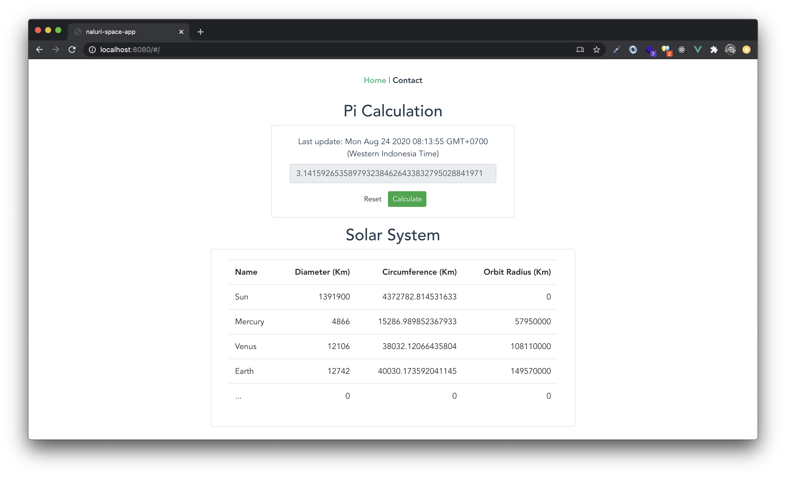

# Naluri Space Project
The Naluri space project is investigating how we could model the solar system.
>Overview



## Prerequisites
These tools must be installed on your local machine:
- Node 12
- Docker

## The Concept
### PI Calculation
Implementing [Spigot Algorithm](https://www.cs.ox.ac.uk/people/jeremy.gibbons/publications/spigot.pdf) by Rabinowitz and Wagon. The code of calculation was inspired by [https://github.com/feedsbrain/calculate-pi](https://github.com/feedsbrain/calculate-pi) with some modification.

Circumference of the sun is calculated using common circle formula: 
```
PI * d = PI * 2r
```

### System architechture
#### Tech stacks
The codebase is using javascript and written using `Typescript`, with following framework:
- ExpressJS for the server / API
- VueJS for the client app / SPA
- Mongo

## How to run
There are several options to run, try to use `quick run` to run it instantly.

### Quick run
```
sh start.sh
```

### Using docker compose
```
docker-compose up -d
```

### Fullstack development
> Backend
```
cd server
npm i
npm run dev
```

> Frontend
```
cd client
npm i
npm run serve
```

## Project structure
This is a monolith project, both of server and client are in one directory.
```
├── README.md
├── client
│   ├── README.md
│   ├── babel.config.js
│   ├── dist
│   ├── package-lock.json
│   ├── package.json
│   ├── public
│   │   ├── favicon.ico
│   │   └── index.html
│   ├── src
│   │   ├── App.vue
│   │   ├── assets
│   │   │   └── logo.png
│   │   ├── components
│   │   │   ├── PiCalculation.vue
│   │   │   └── SunCircumference.vue
│   │   ├── main.ts
│   │   ├── router
│   │   │   └── index.ts
│   │   ├── shims-tsx.d.ts
│   │   ├── shims-vue.d.ts
│   │   ├── store
│   │   │   └── index.ts
│   │   ├── util
│   │   │   └── api.ts
│   │   └── views
│   │       ├── Contact.vue
│   │       └── Home.vue
│   └── tsconfig.json
├── data
├── docker-compose.yml
├── docker-manifest
│   ├── mongo
│   │   └── mongo-init.js
│   └── nginx
│       └── default.conf
├── server
│   ├── Dockerfile
│   ├── jest.config.js
│   ├── package-lock.json
│   ├── package.json
│   ├── src
│   │   ├── app.ts
│   │   ├── controllers
│   │   │   └── home.controller.ts
│   │   ├── exceptions
│   │   │   └── HttpException.ts
│   │   ├── interfaces
│   │   │   └── controller.interface.ts
│   │   ├── lib
│   │   │   ├── circle.ts
│   │   │   └── spigot.ts
│   │   ├── middleware
│   │   │   ├── error.middleware.ts
│   │   │   └── logger.middleware.ts
│   │   ├── models
│   │   │   └── picalculation.model.ts
│   │   └── server.ts
│   ├── tsconfig.json
│   └── tslint.json
└── start.sh
```

## TODO
The next possibly improvements:
- Continue modelling the solar system
- Looking javascript library to illustrate the shape
- Implement CI/CD using gitlab CI or circle CI
- ... feel free to contribute

## Contact
- [Gusman Widodo (Linkedin)](https://www.linkedin.com/in/gusmanwidodo/)
